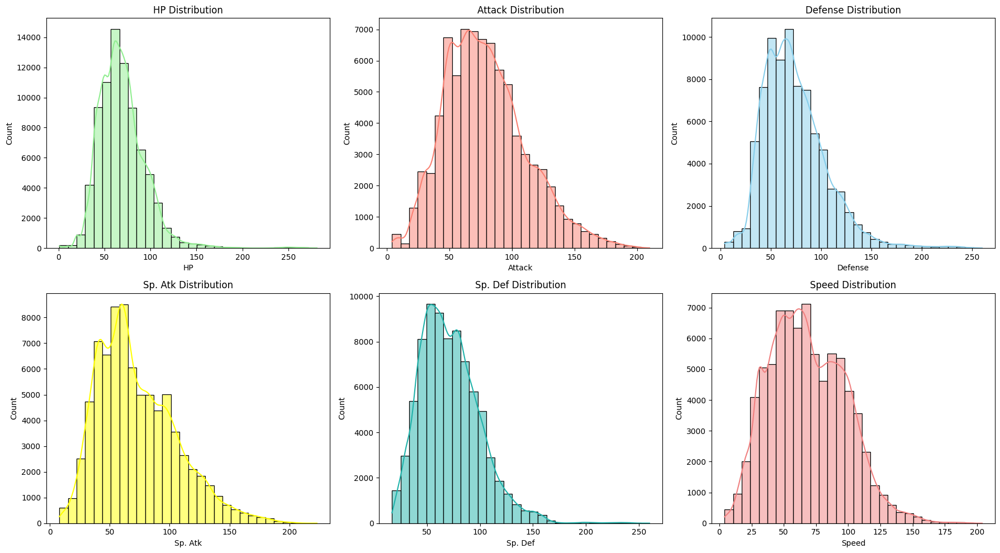
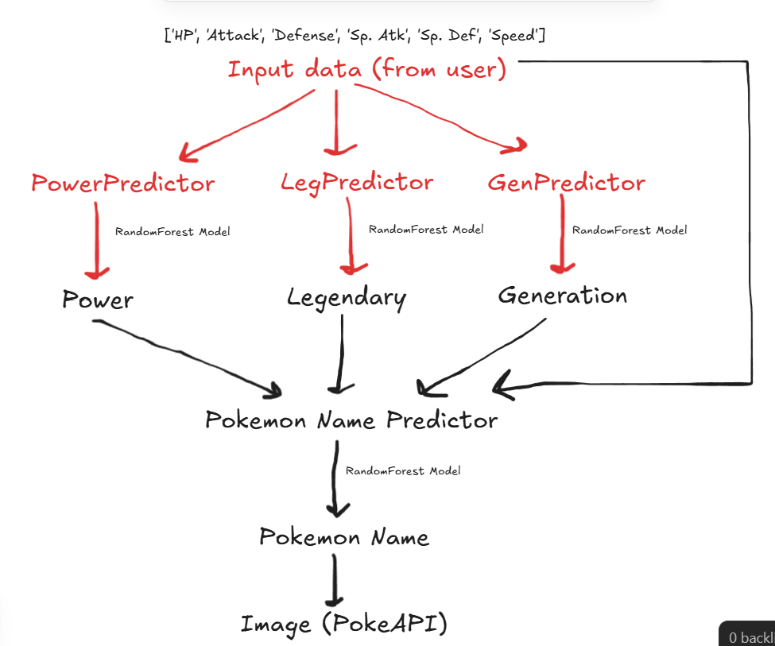

# Pokemon Predictor Dashboard

This project predicts which Pokemon matches a user based on six input stats. The system is trained on Pokemon data, uses data augmentation to create more training examples, and serves the prediction through a Dash web app.

## 1. Data

The project uses `Pokemon.csv`.

It contains the main Pokemon information such as:
- Name
- Type 1 and Type 2
- HP
- Attack
- Defense
- Sp. Atk
- Sp. Def
- Speed
- Generation
- Legendary

A new column called `Power` is also created from the Pokemon types.

## 2. Data Preprocessing

The preprocessing step prepares the dataset for training.

- Load the original Pokemon dataset.
- Create the `Power` column from `Type 1` and `Type 2`.
- Convert `Legendary` into a numeric form.
- Select the six base stats as the main input features.
- Encode the target columns such as `Power`, `Legendary`, `Generation`, and `Name`.
- Prepare the final training columns for the name prediction model.

## 3. Data Augmentation

The original dataset is expanded to make the model more robust.

- Each Pokemon is copied into many extra samples.
- Small random noise is added to the six stats.
- The generated values stay close to the original Pokemon stats.
- This helps the models learn better from more examples.



## 4. Model Architecture

The project uses four `RandomForestClassifier` models.

- `PowerPredictor`: predicts the Pokemon power/type pattern from the six stats.
- `LegendaryPredictor`: predicts whether the Pokemon is legendary.
- `GenerationPredictor`: predicts the Pokemon generation.
- `NamePredictor`: predicts the final Pokemon name.

The first three models give intermediate predictions, and those predictions are passed to the final name model.



## 5. Prediction

The prediction happens in simple stages.

- The user enters six stats.
- The app predicts `Power`, `Legendary`, and `Generation`.
- These predicted values are combined with the original stats.
- The final model predicts the Pokemon name.
- The app also returns a confidence score for the prediction.

## 6. App / API

The project is served through a Dash app in `app.py`.

The app does the following:

- Loads the saved models and encoders.
- Accepts six user inputs through sliders.
- Runs the full prediction pipeline.
- Displays the predicted Pokemon name, image, generation, type, and confidence.
- Shows extra visualizations such as radar comparison, nearest Pokemon list, and scatter plot.

The app uses:

- `server = app.server` for deployment support.
- Port `7860` when running locally.
- Pokemon artwork fetched using the Pokemon ID.

## 7. Main Files

- `dataprep.ipynb`: data preparation, augmentation, and model training
- `app.py`: prediction logic and Dash interface
- `Pokemon.csv`: original dataset
- `models/`: saved models and encoders
- `assets/`: styling and project assets

## Run

```bash
python app.py
```

## Deployment 

the Dashboard is deployed on a HuggingFace Space : 

https://huggingface.co/spaces/Mohamed-M99/Pokemon_Predictor_Dashboard

